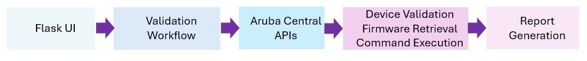

# Aruba Central Cutover Validation Tool

Enhanced fork of Aruba Central Python Workflows focused on cutover validation, firmware visibility, web-based execution, live progress tracking, and operational reporting.

A web-based validation and troubleshooting workflow for Aruba Central environments that enables operators to safely execute validation commands against Access Points, CX Switches, and Gateways while providing firmware visibility, real-time progress tracking, and multi-format reporting.

---

# Overview

The Cutover Validation Tool provides a guided workflow for validating Aruba Central managed infrastructure during:

- Network cutovers
- Device migrations
- Firmware upgrades
- Site onboarding
- Operational troubleshooting
- Validation of newly deployed infrastructure

The solution supports both command-line and web-based execution models and leverages Aruba Central APIs to retrieve device inventory and firmware information.

---

# Key Features

## Web User Interface

The solution includes a modern Flask-based web interface that provides an end-to-end workflow without requiring command-line interaction.

### Capabilities

- Upload Aruba Central credentials
- Upload troubleshooting command files
- Discover Aruba Central sites automatically
- Select sites for validation
- Preview devices before execution
- Display firmware versions
- Launch validation jobs
- Monitor execution progress in real time
- View reports directly in the browser

---

## Device Selection Options

### Site-Based Selection

Automatically discover Aruba Central sites and validate all online devices within selected sites.

Features:

- Dynamic site discovery
- Online device counts
- AP, CX Switch, and Gateway visibility
- Total device visibility per site
- Firmware visibility before execution
- Device preview before execution
- Device type counts (APs, Switches, Gateways)

### Device File Selection

Support for:

- YAML device lists
- CSV device lists

Example:

```yaml
devices:
  - CNK6KS1111
  - VN3AL22222
  - CNJ3333333
```

---

# Supported Device Types

The solution supports:

- Aruba Access Points
- Aruba CX Switches
- Aruba Gateways

---

# Device-Type Based Command Selection

Troubleshooting commands are grouped by device type and automatically applied only to compatible devices.
Example:

```yaml

ap:
  - show ap debug cloud-server
  - show ap association
  - show version

cx:
  - show version
  - show vlan
  - show interface brief

gateway:
  - show version
  - show datapath session

```

### Capabilities

- Device-type based command selection
- AP-specific command support
- Aruba CX switch command support
- Gateway-specific command support
- Automatic device type detection
- Reduced command execution failures

### Benefits

- Prevents unsupported command execution
- Reduces failed API calls
- Supports mixed AP, CX Switch, and Gateway environments
- Produces cleaner validation reports
- Simplifies troubleshooting workflow creation
- Allows command sets to be updated without modifying Python code

# Firmware Visibility

The tool retrieves firmware information directly from Aruba Central using the New Central firmware APIs.

Firmware information is displayed in:

- Site selection previews
- Device tables
- Validation reports
- Result summaries

Example:

| Device | Model | Firmware |
|----------|----------|----------|
| AP1 | AP-505H-RW | 10.7.2.5_95489 |
| 6200 | 6200F | ML.10.16.1006 |
| Aruba9004_1 | 9004-RW | 10.7.2.5_95489 |

---

# Validation Workflow

The workflow follows these steps:

1. Connect to Aruba Central
2. Discover available sites and devices
3. Retrieve firmware information
4. Select devices or sites
5. Identify device types
6. Select device-specific commands
7. Validate troubleshooting commands
8. Execute supported commands
9. Monitor execution progress
10. Generate reports

---

# Live Progress Tracking

The web UI provides real-time execution visibility.

Information displayed includes:

- Completion percentage
- Successful devices
- Failed devices
- Last completed device
- Execution status

Example:

```text
Running Validation

████████████████████ 100%

Completed: 14 / 14

Successful: 14
Failed: 0

✅ Validation Complete

[ View Results ]
```

The workflow intentionally waits for the operator to review the completion summary before proceeding to the results page.

---

# Reporting

The tool automatically generates multiple report formats.

## HTML Reports

Interactive browser-based reports including:

- Device details
- Firmware versions
- Validation output
- Command results

## JSON Reports

Machine-readable output for automation and integrations.

## Markdown Reports

Human-readable reports suitable for documentation and change records.

---

# Command Validation

Before execution, commands are validated against the target device type.

Benefits include:

- Preventing unsupported commands
- Reducing execution failures
- Device-specific command validation
- Safer troubleshooting workflows

---

# Safety Features

The tool provides multiple safeguards:

- Offline devices are skipped
- Devices without site assignment are skipped
- Invalid commands are identified and excluded
- Device status verification before execution
- Execution confirmation prompts

---

# Web UI Technologies

The web interface is built using:

| Technology | Purpose |
|------------|---------|
| Flask | Web framework |
| Jinja2 | HTML template rendering |
| HTML5 | UI structure |
| CSS3 | Styling and responsive layout |
| JavaScript | Dynamic interactions |
| Fetch API | Live progress updates |
| Python | Validation workflow engine |
| PyCentral SDK | Aruba Central integration |
| Aruba Central APIs | Firmware, device and site information |

---


<h1>Architecture</h1>

<p align="center">
  
</p>


---

# Installation

Clone the repository:

```bash
git clone -b feature/cutover-validation-enhancements https://github.com/ariyaparsa-dev/central-python-workflows.git
```

Change to the application directory:

```bash
cd central-python-workflows/cutover-validation
```

Install dependencies:

```bash
pip install -r requirements.txt
```

---

# Running the Web Interface

Start the application:

```bash
python app.py
```

Open:

```text
http://127.0.0.1:5000
```

in your browser.

---

# Recent Enhancements

## Validation Enhancements

- Site-based device selection
- Device preview capabilities
- Online device filtering
- Improved command validation

## Firmware Integration

- Aruba Central firmware API integration
- Firmware version visibility
- Firmware reporting support

## Web UI Enhancements

- Flask-based workflow
- Real-time execution tracking
- Browser-based reporting
- Manual results review workflow

## Operational Improvements

- Success/failure counters
- Progress dashboard
- Device status visibility
- Improved user experience

---

# Future Enhancements

Planned improvements include:

- Firmware API pagination support
- Site-scoped firmware retrieval
- Firmware recommendation reporting
- Multi-site selection
- Device filtering and search
- Enhanced reporting dashboards

---
# Author

Enhanced and maintained by Ariya Parsamanesh
